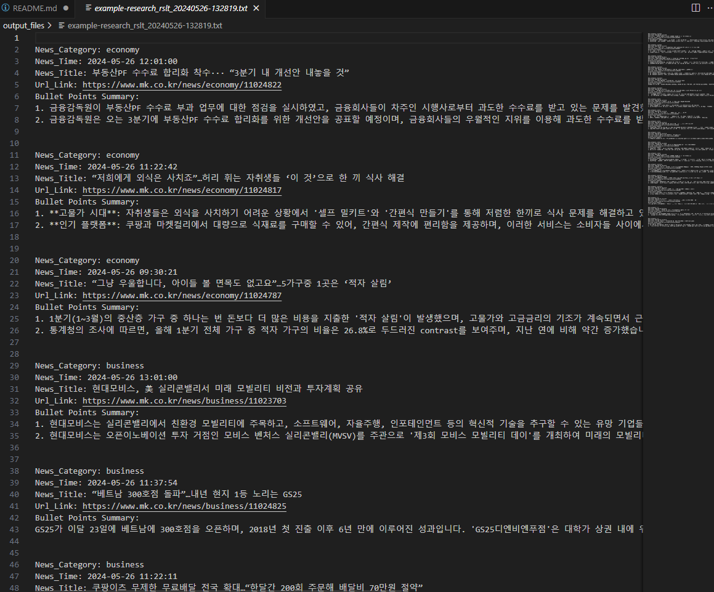
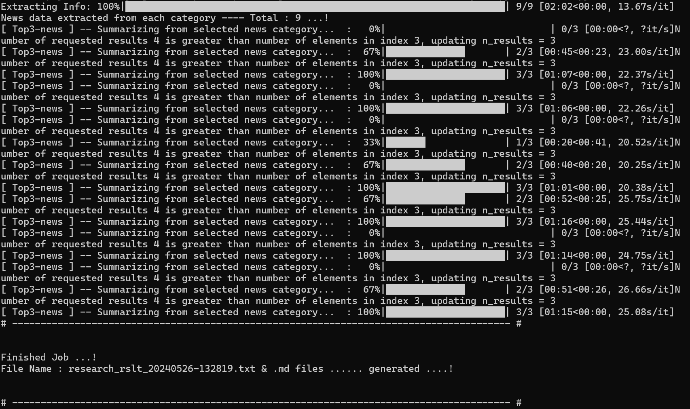

# AI 실시간 뉴스 요약
### Realtime AI K-News Summarizer:

**Langchain** 프레임워크 - **RAG** (Retrieval-Augmented Generation)을 활용하여 만든 실시간 AI-뉴스 요약 프로그램 입니다.

실시간으로 뉴스(매일경제 사이트)에서 가져와 LLM이 바로 요약을 해줍니다.
모든 분야의 뉴스를 실시간으로 가져오며 분야별 상위 3개의 기사만 요약하도록 프로그래밍 되어 있습니다. (필요시 분야/개수 변경 가능)

분야별로 요약된 기사는 텍스트파일로 **"output_files"** 폴더에 저장됩니다. 

 

#### CMD example:

 > output_files 폴더에 있는 sample 결과 텍스트 파일을 확인해 보세요.

 

## Installation:
사전에 Ollama를 설치하여 Microsoft가 제공하는 LLM모델 **"wizardlm2"** 를 설치하여야 합니다. Ollama 및 LLM모델 설치는 아래 URL를 참고하여 설치하시기 바랍니다.
- URL: https://ollama.com/download

 

**1. Requirements:**
1. OS: Windows 11 (테스트된 환경) 
2. Python Version 3.10.0 설치
3. requirements.txt 필요/담긴 라이브러리 설치
4. 메인 디렉토리로 이동 및 CMD 실행
5. CMD:
    - python ./main.py

 

**2. GPU Used:**
- NVIDIA GeForce RTX 3080 Ti Laptop GPU (16GB)
  - Minimum 6~8GB GPU Memory recomanded
  - Minimum 32GB RAM recomanded

 

## CMD LOG

#### Examples:

